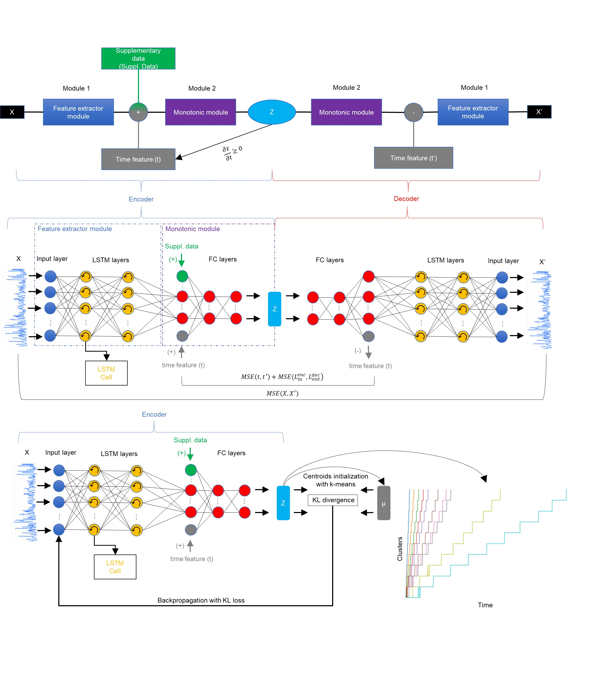
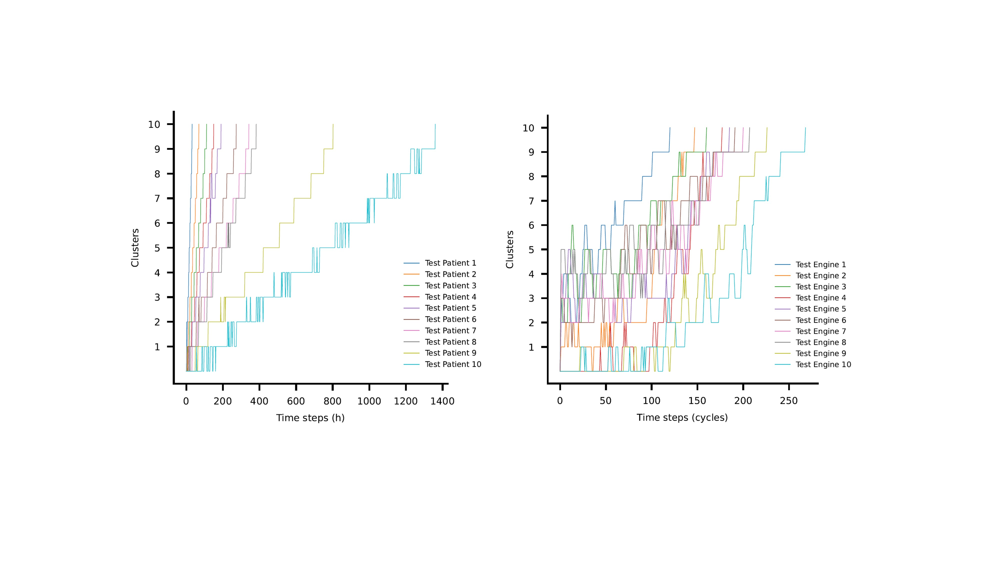

# DSMC: Deep Soft Monotonic Clustering for Label-Free Degradation Modelling

[](https://www.python.org/)
[](https://pytorch.org/)
[](LICENSES/CC-BY-SA-4.0.txt)
[](https://doi.org/10.5281/zenodo.15234519)

A deep model that learns a **health indicator** for a deteriorating system straight from raw sensor data, with **no labels**, and groups the readings into ordered stages of deterioration. Its defining feature is a **monotonic neural network**: the learned health value can only grow as the system ages, which is exactly how real wear and illness progress.

Published in *Data-Centric Engineering* (Cambridge University Press), 2026.



## The idea in one paragraph

A health indicator should rise as a machine wears out or a patient worsens. Standard neural networks have no notion of this, so their features wander up and down with noise. DSMC builds the constraint into the network itself: every weight in the monotonic layers is passed through an exponential so it stays positive, which forces the output to increase with the time input. The result is a feature that trends upward by construction. Crucially the constraint is **soft**: it is enforced against time, not hard-coded onto the feature, so the model can still capture genuine **recoveries** (a patient improving, then declining again) instead of papering over them.

## Why it matters

- **Label-free.** It needs no failure labels or health annotations, which are rarely available for real assets. It learns the degradation signal on its own.
- **Beats clinical scores.** On the MIMIC-III intensive-care dataset, the features DSMC extracted fed a prognostic model that outperformed the SOFA, SAPS III, and APACHE II scoring systems that hospitals use today.
- **Model-agnostic features.** On the C-MAPSS jet-engine dataset, the same features gave similar prediction quality across three different downstream models (a hidden semi-Markov model, gradient-boosted trees, and support vector regression). The features carry the signal, regardless of what predicts on top of them.
- **Works on messy multi-modal data.** It was also validated on a composite-fatigue dataset that fuses acoustic sensors and images.

## Quickstart (no dataset needed)

This builds the monotonic feature extractor and shows its defining behaviour, that the learned health feature only increases as the time input grows. Runs in seconds on CPU.

```bash
git clone https://github.com/<your-username>/DSMC.git
cd DSMC
python -m venv .venv && source .venv/bin/activate      # Windows: .venv\Scripts\activate
pip install -r requirements.txt
python examples/demo_monotonic.py
```

Expected output (values are random because the weights are untrained; the increasing trend is the point):

```
Monotonic autoencoder built. Trainable parameters: 0.043M
Health feature at t=0.0 : 2836.972
Health feature at t=1.0 : 5258.229
Smallest step-to-step change: 4.039e+01
The health feature is monotonically non-decreasing in time, as designed.
```

Run the smoke tests (these also check the monotonicity property automatically):

```bash
pip install pytest
pytest
```

## How it works

DSMC trains in two stages:

1. **Monotonic autoencoder.** An LSTM encoder compresses the input sequence, then a stack of monotonic layers maps it, together with a time value, to a small set of health features. Because those layers are weight-constrained, the features increase with time. The decoder reconstructs the input, so the whole thing trains without labels.
2. **Deep clustering.** A clustering head assigns each reading to one of several ordered stages using a Student t soft assignment. A higher cluster means closer to failure (end of life for an engine, higher mortality risk for a patient). Ten stages are used for the engine and clinical datasets.

Hyperparameters can be tuned automatically with the included Bayesian optimization routine.

## Results

Clustering of ten test trajectories for the C-MAPSS engines and MIMIC-III patients. Cluster index rises monotonically as each trajectory approaches failure.



## Running on the real datasets

All three datasets are public. The C-MAPSS engine dataset is the easiest starting point.

| Dataset  | Domain                | Access |
| -------- | --------------------- | ------ |
| C-MAPSS  | Jet-engine degradation | Free, open. [NASA](https://data.nasa.gov/dataset/cmapss-jet-engine-simulated-data) |
| MIMIC-III | Intensive-care patients | Free but requires a signed data-use agreement and HIPAA training (approval takes about a week). [PhysioNet](https://mimic.mit.edu/) |
| F-MOC    | Composite fatigue (acoustic + images) | Free. [Mendeley Data](https://data.mendeley.com/datasets/4zm6jh8jkd/1) |

Place the dataset files in the `dsmc` folder (the code moves them into the right subfolders automatically), then run from inside it:

```bash
cd dsmc
python main.py                          # C-MAPSS, the default
python main.py --mimic True --pretrained True   # MIMIC-III using pretrained weights
python main.py --fmoc True --pretrained True    # F-MOC (multi-modal) using pretrained weights
python main.py --bayesian_opt True              # tune hyperparameters from scratch
```

See `main.py` for the full list of options. Results are written to `dsmc/results/`. A GPU helps for training (tested on an NVIDIA RTX 2080) but the code also runs on CPU.

## Repository structure

```
DSMC/
├── dsmc/                       # model, training, and data code
│   ├── models.py               # monotonic layers, autoencoder, clustering head
│   ├── run_models.py           # training and evaluation loops
│   ├── main.py                 # entry point and command-line options
│   ├── read_files.py           # C-MAPSS data handling
│   ├── mimic_data.py           # MIMIC-III clinical data handling
│   ├── bayesian_opt/           # hyperparameter optimization
│   └── ...
├── examples/
│   └── demo_monotonic.py       # dataset-free demo (start here)
├── tests/
│   └── test_smoke.py           # fast sanity checks, including monotonicity
├── Figs/                       # concept and results figures
├── LICENSES/                   # CC-BY-SA-4.0 (code) and MIT (dataset)
├── requirements.txt
├── pyproject.toml
└── CITATION.cff
```

## Citation

If you use this code, please cite:

```bibtex
@article{komninos2026robust,
  title   = {A robust generalized deep monotonic feature extraction model for label-free prediction of degenerative phenomena},
  author  = {Komninos, P. and Kontogiannis, T. and Eleftheroglou, N. and Zarouchas, D.},
  journal = {Data-Centric Engineering},
  year    = {2026},
  publisher = {Cambridge University Press}
}
```

## License

The source code is licensed under CC-BY-SA-4.0 (see `LICENSES/CC-BY-SA-4.0.txt`). The accompanying dataset is licensed under MIT (see `LICENSES/MIT.txt`).

Copyright notice: Technische Universiteit Delft disclaims all copyright interest in the program "Deep Soft Monotonic Clustering (DSMC) model" (the source code licensed under CC-BY-SA-4.0). Henri Werij, Dean of the Faculty of Aerospace Engineering, Technische Universiteit Delft.

## Authors

P. Komninos and T. Kontogiannis, with N. Eleftheroglou and D. Zarouchas. Developed at the Center of Excellence in Artificial Intelligence for Structures, Prognostics and Health Management, Faculty of Aerospace Engineering, Delft University of Technology.
